<h1 align="center">
🌟 Aphrodite Engine
</h1>
<h3 align="center">Breathing Life into Language</h3>

<div align="center">

[](LICENSE)
[](https://www.python.org/downloads/)
[](https://developer.nvidia.com/cuda-downloads)
[](https://aphrodite.pygmalion.chat)

</div>


## 🚀 Overview

Aphrodite Engine is a high-performance, production-ready inference engine designed to serve large language models at scale. Built on the foundation of vLLM's revolutionary PagedAttention technology, Aphrodite delivers exceptional throughput and efficiency for concurrent model inference workloads.

**Key Differentiators:**
- 🔥 **High-Performance**: Optimized CUDA kernels and efficient memory management
- 🔄 **Continuous Batching**: Advanced request batching for maximum GPU utilization  
- 🎯 **Production Ready**: Battle-tested serving infrastructure with comprehensive API compatibility
- 🔧 **Extensible**: Support for custom models, quantization schemes, and sampling methods
- 🌐 **Distributed**: Built-in support for tensor parallelism and pipeline parallelism

Developed through a collaboration between [PygmalionAI](https://pygmalion.chat) and [Ruliad](https://ruliad.co), Aphrodite powers high-scale chat platforms and API infrastructure worldwide.

> [!CAUTION]
> Development is currently happening in [#1388](https://github.com/aphrodite-engine/aphrodite-engine/pull/1388).

## 📋 Table of Contents

- [🧠 Deep Tree Echo Integration](#-deep-tree-echo-integration)
- [🏗️ System Architecture](#️-system-architecture)
- [✨ Key Features](#-key-features)
- [🚀 Quick Start](#-quick-start)
- [📋 Requirements](#-requirements)
- [🐳 Docker Deployment](#-docker-deployment)
- [🔧 Configuration](#-configuration)
- [📊 Performance & Benchmarks](#-performance--benchmarks)
- [📚 Documentation](#-documentation)
- [🤝 Contributing](#-contributing)
- [🙏 Acknowledgements](#-acknowledgements)

## 🧠 Deep Tree Echo Integration

> **Next-Generation Embodied AI Architecture**

This repository features an advanced integration of **Deep Tree Echo Membrane Computing** with the Aphrodite Engine, implementing a comprehensive 4E Embodied AI framework with Echo-Self AI Evolution Engine and Agent-Arena-Relation (AAR) orchestration.

### 🌟 Echo Systems Overview

The Aphrodite Engine integrates **six specialized Echo systems** that collectively provide advanced cognitive capabilities:

| System | Purpose | Status | Key Features |
|--------|---------|--------|-------------|
| 🌳 **Echo.Dash** | Cognitive Architecture Hub | ✅ Active | Deep Tree Echo core, migration system, API standardization |
| 💭 **Echo.Dream** | Agent-Arena-Relation | ✅ Active | Distributed cognition, recursive self-modification, hypergraph evolution |
| 📁 **Echo.Files** | Resource Management | ✅ Active | ECAN allocation, Julia DTESN cores, P-Lingua membranes |
| 🔧 **Echo.Kern** | DTESN Kernel | ✅ Active | Real-time processing, neuromorphic HAL, performance validation |
| 🌐 **Echo.RKWV** | Production Deployment | ✅ Active | WebVM integration, microservices, monitoring (2500+ req/min) |
| 🔄 **Echo.Self** | AI Evolution Engine | ✅ Active | Adaptive architecture, meta-learning, neural-symbolic bridge |

**📋 Complete Documentation**: [Echo Systems Architecture Overview](ECHO_SYSTEMS_ARCHITECTURE.md)

### 🎯 Key Integration Components

- **Echo-Self AI Evolution Engine**: Self-optimizing neural architectures through genetic algorithms
- **Agent-Arena-Relation (AAR)**: Multi-agent orchestration and simulation environments  
- **4E Embodied AI Framework**: Embodied, Embedded, Extended, and Enactive artificial intelligence
- **DTESN Kernel**: Deep Tree Echo State Networks with P-System membrane computing
- **Sensory-Motor Integration**: Virtual sensory analogues with proprioceptive feedback loops
- **Dynamic MLOps**: Real-time model training and optimization pipeline

### 📚 Documentation

- **[Deep Tree Echo Development Roadmap](DEEP_TREE_ECHO_ROADMAP.md)** - Comprehensive 4-phase development plan
- **[Deep Tree Echo Architecture](DEEP_TREE_ECHO_ARCHITECTURE.md)** - Technical integration specifications
- **[Echo.Kern Documentation](echo.kern/)** - DTESN kernel implementation and guides

### 🚀 Getting Started with Deep Tree Echo

```bash
# Enable Deep Tree Echo features
export DEEP_TREE_ECHO_ENABLED=true
export AAR_ORCHESTRATION=true
export EMBODIED_AI_FRAMEWORK=true

# Run with advanced features
aphrodite run meta-llama/Meta-Llama-3.1-8B-Instruct \
  --deep-tree-echo \
  --enable-evolution-engine \
  --aar-max-agents 1000 \
  --embodied-cognition
```

## 🏗️ System Architecture

Aphrodite Engine employs a sophisticated multi-layered architecture optimized for high-throughput LLM inference:


### 🔄 Request Processing Flow


### 🧠 Core Components

| Component | Purpose | Key Features |
|-----------|---------|--------------|
| **Engine Core** | Central orchestration | Request lifecycle management, async processing |
| **Scheduler** | Request batching & prioritization | Continuous batching, memory-aware scheduling |
| **Model Executor** | Model inference execution | Optimized forward passes, distributed execution |
| **KV Cache Manager** | Attention state management | Paged memory, efficient cache allocation |
| **Block Manager** | Memory allocation | GPU/CPU memory pools, dynamic allocation |
| **API Server** | HTTP interface | OpenAI-compatible REST API, streaming support |


## 🔥 News & Updates

**🚀 Latest Release (09/2024): v0.6.1** - Advanced Quantization Support
- ⚡ Load FP16 models in ultra-low precision FP2-FP7 formats
- 🎯 Achieve 5-10x memory reduction with minimal quality loss
- 📊 Extreme throughput improvements for large model deployment

**🎉 Major Release (09/2024): v0.6.0** - Performance Revolution
- 🚄 **Massive throughput improvements** across all model sizes
- 🔧 **New quantization formats**: FP8, llm-compressor integration
- 🌐 **Asymmetric tensor parallel**: Optimized multi-GPU scaling
- 🔄 **Pipeline parallelism**: Support for models that don't fit on single nodes
- 📚 **Comprehensive documentation**: Complete user and developer guides

**🎯 Roadmap Highlights:**
- **Q4 2024**: Multi-modal model support expansion
- **Q1 2025**: Advanced reasoning capabilities
- **Q2 2025**: Edge deployment optimizations

> 💡 **Stay Updated**: Follow our [documentation](https://aphrodite.pygmalion.chat) for the latest features and optimizations!

## ✨ Key Features

### 🚄 Performance & Scalability
- **Continuous Batching**: Advanced request batching that maximizes GPU utilization
- **PagedAttention**: Efficient K/V cache management reducing memory fragmentation  
- **Optimized CUDA Kernels**: Custom kernels for improved inference performance
- **Distributed Inference**: Tensor parallelism and pipeline parallelism support
- **8-bit KV Cache**: Higher context lengths with FP8 E5M3 and E4M3 formats

### 🔧 Model Support & Quantization
- **Universal Compatibility**: HuggingFace-compatible model serving
- **Advanced Quantization**: AQLM, AWQ, Bitsandbytes, GGUF, GPTQ, QuIP#, SqueezeLLM, Marlin
- **Precision Formats**: FP2-FP12, FP8, INT4, INT8 quantization support  
- **Dynamic Loading**: Runtime model and adapter loading/unloading

### 🎛️ Advanced Sampling & Generation
- **Modern Samplers**: DRY, XTC, Mirostat, and more sophisticated sampling methods
- **Structured Output**: JSON, grammar-guided generation support
- **Multi-Modal**: Vision, audio, and text processing capabilities
- **Tool Integration**: Function calling and tool use support

### 🌐 Production Features  
- **OpenAI API Compatibility**: Drop-in replacement for OpenAI API
- **Streaming Support**: Server-sent events and WebSocket streaming
- **Robust Authentication**: API key management and rate limiting
- **Comprehensive Monitoring**: Prometheus metrics and health checks

### 📊 Architecture Highlights


## 🚀 Quick Start

### 📦 Installation

Install the engine with all dependencies:

```bash
pip install -U aphrodite-engine --extra-index-url https://downloads.pygmalion.chat/whl
```

### 🏃‍♂️ Launch Your First Model

Start serving a model with a single command:

```bash
aphrodite run meta-llama/Meta-Llama-3.1-8B-Instruct
```

**💡 Memory Optimization**: For non-production use, add `--single-user-mode` to limit memory allocation.

This creates an [OpenAI-compatible API](https://platform.openai.com/docs/api-reference/) server accessible at `http://localhost:2242`.

### 🔌 API Usage Example

```python
import openai

# Configure client to use Aphrodite
client = openai.OpenAI(
    base_url="http://localhost:2242/v1",
    api_key="sk-empty"  # Not required for local deployment
)

# Generate text
response = client.chat.completions.create(
    model="meta-llama/Meta-Llama-3.1-8B-Instruct",
    messages=[
        {"role": "user", "content": "Explain quantum computing in simple terms."}
    ],
    max_tokens=150,
    temperature=0.7
)

print(response.choices[0].message.content)
```

### 🎮 Interactive Demo

Try Aphrodite Engine in your browser:

[](https://colab.research.google.com/github/AlpinDale/misc-scripts/blob/main/Aphrodite.ipynb)

### 📖 Complete Documentation

For advanced configuration, deployment options, and API reference:
**[📚 Visit Full Documentation](https://aphrodite.pygmalion.chat)**

## 🐳 Docker Deployment

### 🚀 Quick Docker Setup

Pull and run the pre-built Docker image:

```bash
docker run --runtime nvidia --gpus all \
    -v ~/.cache/huggingface:/root/.cache/huggingface \
    -p 2242:2242 \
    --ipc=host \
    alpindale/aphrodite-openai:latest \
    --model NousResearch/Meta-Llama-3.1-8B-Instruct \
    --api-keys "your-api-key-here"
```

### 🏗️ Multi-GPU Configuration

For distributed inference across multiple GPUs:

```bash
docker run --runtime nvidia --gpus all \
    -v ~/.cache/huggingface:/root/.cache/huggingface \
    -e "CUDA_VISIBLE_DEVICES=0,1,2,3" \
    -p 2242:2242 \
    --ipc=host \
    alpindale/aphrodite-openai:latest \
    --model meta-llama/Meta-Llama-3.1-70B-Instruct \
    --tensor-parallel-size 4 \
    --api-keys "your-api-key"
```

### 📊 Docker Architecture


## 🔧 Configuration

### ⚙️ Essential Parameters

| Parameter | Description | Example |
|-----------|-------------|---------|
| `--model` | HuggingFace model path | `meta-llama/Llama-2-7b-hf` |
| `--tensor-parallel-size` | Number of GPUs for model | `4` |
| `--max-model-len` | Maximum sequence length | `4096` |
| `--gpu-memory-utilization` | GPU memory usage (0.0-1.0) | `0.9` |
| `--quantization` | Quantization method | `awq`, `gptq`, `fp8` |

### 🎛️ Advanced Configuration

```bash
# Production deployment with optimizations
aphrodite run meta-llama/Meta-Llama-3.1-8B-Instruct \
    --host 0.0.0.0 \
    --port 2242 \
    --tensor-parallel-size 2 \
    --max-model-len 8192 \
    --gpu-memory-utilization 0.95 \
    --disable-log-requests \
    --quantization fp8 \
    --kv-cache-dtype fp8 \
    --api-keys "sk-your-key-here"
```

### 📈 Performance Tuning

```mermaid
flowchart LR
    subgraph "Memory Optimization"
        A[GPU Memory<br/>Utilization] --> B[KV Cache<br/>Quantization]
        B --> C[Block Size<br/>Tuning]
    end
    
    subgraph "Compute Optimization"  
        D[Tensor<br/>Parallelism] --> E[CUDA<br/>Kernels]
        E --> F[Mixed<br/>Precision]
    end
    
    subgraph "Scheduling"
        G[Batch Size<br/>Optimization] --> H[Continuous<br/>Batching]
        H --> I[Request<br/>Prioritization]
    end
    
    C --> D
    F --> G
    I --> Performance[🚀 Optimal<br/>Performance]
    
    style Performance fill:#4caf50
```



## 📋 Requirements

### 🖥️ System Requirements
- **Operating System**: Linux (recommended), Windows (build from source)
- **Python Version**: 3.9 to 3.12
- **CUDA**: Version 12.0 or higher

### 🎯 Supported Hardware


### 💾 Memory Requirements

| Model Size | Minimum VRAM | Recommended VRAM | Context Length |
|------------|---------------|------------------|----------------|
| 7B params | 8 GB | 16 GB | 4K-32K tokens |
| 13B params | 16 GB | 24 GB | 4K-32K tokens |
| 34B params | 24 GB | 48 GB | 4K-16K tokens |
| 70B params | 48 GB | 80 GB | 4K-8K tokens |

### 🔧 Build Requirements
- **NVIDIA**: CUDA Development Kit 12.0+
- **AMD**: ROCm 5.7+ (for AMD GPU support)
- **Build Tools**: CMake, GCC/Clang, Python development headers


## 📊 Performance & Benchmarks

### 🏆 Performance Characteristics

Aphrodite Engine delivers industry-leading performance through architectural optimizations:


### 📈 Scaling Characteristics

| GPUs | Model Size | Throughput | Concurrent Users |
|------|------------|------------|------------------|
| 1x A100 | 7B | ~8,000 tok/s | 50-100 |
| 2x A100 | 13B | ~12,000 tok/s | 80-150 |
| 4x A100 | 34B | ~15,000 tok/s | 100-200 |  
| 8x A100 | 70B | ~20,000 tok/s | 150-300 |

### 🎯 Memory Efficiency Comparison

```mermaid
xychart-beta
    title "Memory Usage: Aphrodite vs Alternatives"
    x-axis [7B, 13B, 34B, 70B]
    y-axis "Memory (GB)" 0 --> 200
    line [12, 18, 32, 64] "Aphrodite"
    line [24, 36, 68, 128] "Standard Transformers"
    line [18, 28, 48, 96] "Other Optimized Engines"
```

## 💡 Key Optimizations

### 🧠 Memory Management
- **Paged Attention**: Eliminates memory fragmentation in KV cache
- **Block Allocation**: Dynamic memory allocation with minimal waste
- **Quantized KV Cache**: FP8 cache reduces memory usage by 2x

### ⚡ Compute Optimization  
- **Fused Kernels**: Combined operations reduce memory bandwidth
- **Tensor Parallelism**: Model sharding across multiple GPUs
- **Mixed Precision**: FP16/BF16 for optimal speed/accuracy balance

### 🔄 Request Processing
- **Continuous Batching**: Dynamic batching without padding waste
- **Priority Scheduling**: Optimal request ordering for throughput
- **Streaming**: Reduced perceived latency with SSE responses

## 🙏 Acknowledgements

Aphrodite Engine builds upon the extraordinary work of the open-source community. We're grateful to these pioneering projects:

### 🏗️ Core Infrastructure
- **[vLLM](https://github.com/vllm-project/vllm)** - PagedAttention and core architecture foundation
- **[Ray](https://github.com/ray-project/ray)** - Distributed computing framework
- **[FastAPI](https://fastapi.tiangolo.com/)** - High-performance API framework

### 🧠 ML & Optimization Libraries
- **[Flash Attention](https://github.com/Dao-AILab/flash-attention)** - Efficient attention mechanisms
- **[xFormers](https://github.com/facebookresearch/xformers)** - Memory-efficient transformers
- **[TensorRT-LLM](https://github.com/NVIDIA/TensorRT-LLM)** - NVIDIA optimization libraries
- **[Megatron-LM](https://github.com/NVIDIA/Megatron-LM)** - Large-scale transformer training

### 🔧 Quantization & Compression
- **[AutoAWQ](https://github.com/casper-hansen/AutoAWQ)** - Activation-aware weight quantization
- **[AutoGPTQ](https://github.com/PanQiWei/AutoGPTQ)** - GPTQ quantization implementation
- **[AQLM](https://github.com/Vahe1994/AQLM)** - Additive quantization for language models
- **[SqueezeLLM](https://github.com/SqueezeAILab/SqueezeLLM/)** - Dense-and-sparse quantization
- **[Exllamav2](https://github.com/turboderp/exllamav2)** - GPTQ inference library

### 🌐 Ecosystem & Tools
- **[llama.cpp](https://github.com/ggerganov/llama.cpp)** - Efficient CPU inference
- **[TabbyAPI](https://github.com/theroyallab/tabbyAPI)** - API compatibility layer
- **[KoboldAI](https://github.com/henk717/KoboldAI)** - AI-assisted writing platform
- **[Text Generation WebUI](https://github.com/oobabooga/text-generation-webui)** - User interface inspiration

## 💎 Sponsors & Partners

### 🏢 Organizational Sponsors
*Past and present, in alphabetical order:*

| Sponsor | Contribution |
|---------|-------------|
| **[Arc Compute](https://www.arccompute.io/)** | Infrastructure & compute resources |
| **[Prime Intellect](https://www.primeintellect.ai/)** | Research collaboration & funding |
| **[PygmalionAI](https://pygmalion.chat)** | Core development & maintenance |
| **[Ruliad AI](https://ruliad.ai)** | Advanced research & optimization |

### 🤝 Development Partners
- **Research Institutions**: Contributing to algorithmic improvements
- **Cloud Providers**: Offering infrastructure for testing and development  
- **Hardware Vendors**: Providing access to cutting-edge accelerators
- **Community Contributors**: Individual developers worldwide

---

<div align="center">

**Built with ❤️ by the open-source community**

*Aphrodite Engine - Empowering the next generation of AI applications*

[](https://star-history.com/#EchoCog/aphroditecho&Date)

</div>


## 📚 Documentation

### 🎯 Core Documentation
- **[Echo Systems Architecture](ECHO_SYSTEMS_ARCHITECTURE.md)** - Comprehensive overview of all Echo.* systems
- **[Technical Reference Index](ECHO_TECHNICAL_REFERENCES.md)** - Complete technical documentation index
- **[Deep Tree Echo Architecture](DEEP_TREE_ECHO_ARCHITECTURE.md)** - Integration specifications
- **[Development Roadmap](DEEP_TREE_ECHO_ROADMAP.md)** - Implementation roadmap

### 🔧 System-Specific Documentation
- **Echo.Dash**: [Deep Tree Echo Catalog](echo.dash/DEEP_TREE_ECHO_CATALOG.md) | [Migration Roadmap](echo.dash/MIGRATION_ROADMAP.md)
- **Echo.Dream**: [Agent-Arena-Relation](echo.dream/README.md) | [Cognitive Flowcharts](echo.dream/README.md#cognitive-flowchart)
- **Echo.Files**: [ECAN Resource Allocation](echo.files/ECAN_RESOURCE_ALLOCATION_PATHWAYS.md)
- **Echo.Kern**: [DTESN Development](echo.kern/DEVO-GENESIS.md) | [Performance Tests](echo.kern/tests/)
- **Echo.RKWV**: [Production Deployment](echo.rkwv/README.md) | [API Ecosystem](echo.rkwv/API_ECOSYSTEM_SUMMARY.md)
- **Echo.Self**: [Evolution Engine](echo_self/README.md) | [Adaptive Architecture](echo_self/adaptive_architecture/)

### 📖 Getting Started Guides
- **Installation**: Follow the [Quick Start](#-quick-start) guide above
- **Development**: See [Contributing Guidelines](CONTRIBUTING.md)
- **Docker Deployment**: Use the [Docker section](#-docker-deployment)
- **Configuration**: Check [Configuration options](#-configuration)

## 🤝 Contributing

We welcome contributions from the community! Aphrodite Engine thrives on collaborative development.

### 🎯 Ways to Contribute

- 🐛 **Bug Reports**: Help us identify and fix issues
- ✨ **Feature Requests**: Suggest new capabilities and improvements  
- 📝 **Documentation**: Improve guides, examples, and API docs
- 🧪 **Testing**: Add test coverage and validation scenarios
- 🔧 **Performance**: Optimize kernels, algorithms, and memory usage
- 🌐 **Integrations**: Build connectors and client libraries

### 🚀 Development Setup

```bash
# Clone the repository
git clone https://github.com/EchoCog/aphroditecho.git
cd aphroditecho

# Install in development mode
pip install -e .

# Install development dependencies
pip install -r requirements/requirements-dev.txt

# Run tests
pytest tests/
```

### 📋 Contribution Guidelines

1. **Fork & Branch**: Create a feature branch from `main`
2. **Code Quality**: Follow existing code style and add tests
3. **Documentation**: Update docs for new features
4. **Testing**: Ensure all tests pass and add new test coverage
5. **Pull Request**: Submit PR with clear description and rationale

See our [CONTRIBUTING.md](CONTRIBUTING.md) for detailed guidelines.

## 🔗 Community & Support

- 💬 **Discord**: Join our [development community](https://discord.gg/pygmalion)
- 📧 **Issues**: Report bugs on [GitHub Issues](https://github.com/EchoCog/aphroditecho/issues)
- 📚 **Documentation**: [Complete guides and API reference](https://aphrodite.pygmalion.chat)
- 🐦 **Updates**: Follow [@PygmalionAI](https://twitter.com/PygmalionAI) for news
