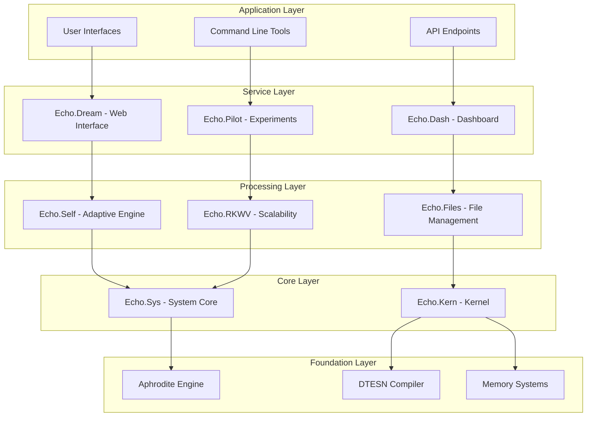
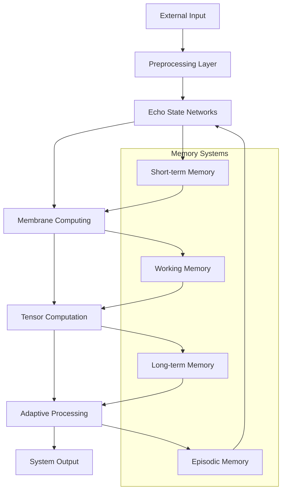
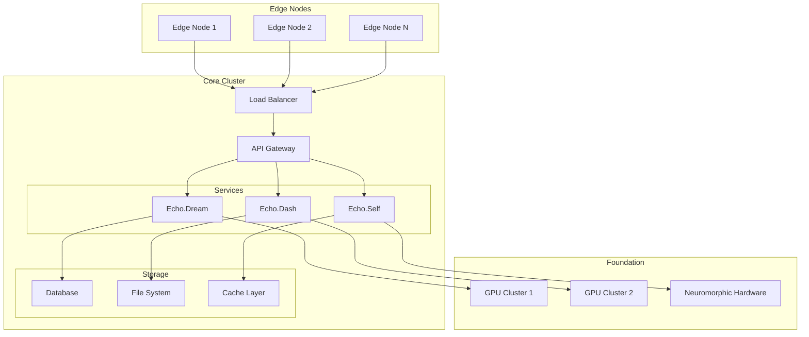

# Deep Tree Echo - System Architecture

## Architectural Principles

Deep Tree Echo is built on several foundational principles:

1. **Recursive Cognitive Processing**: Self-similar structures at multiple scales
2. **Membrane-Based Computation**: P-system inspired processing units
3. **Echo State Networks**: Reservoir computing for dynamic memory
4. **Adaptive Evolution**: Self-modifying architectural patterns
5. **Multi-Modal Integration**: Unified processing of diverse data types

## System Layers

## Core Components

### Echo.Sys - System Core
**Purpose**: Central coordination and system management
**Key Features**:
- System prompt management
- Character configuration (Pyper integration)
- VM daemon coordination
- Spark system integration

**Technical Details**:
- Manages system-wide configuration
- Coordinates between subsystems
- Handles character AI integration
- Provides foundational services

### Echo.Kern - Kernel Layer
**Purpose**: Low-level cognitive computation kernel
**Key Features**:
- DTESN (Deep Tree Echo State Networks) implementation
- B-series differential computation
- P-system membrane computing
- Neuromorphic hardware abstraction

**Technical Details**:
- C/C++ implementation for performance
- CUDA/OpenCL support for GPU acceleration
- Integration with neuromorphic chips
- Mathematical computation engines

### Echo.Self - Adaptive Architecture
**Purpose**: Self-modifying and evolving cognitive structures
**Key Features**:
- Adaptive architecture engine
- Meta-learning capabilities
- Evolution-based optimization
- Real-time architectural adaptation

**Technical Details**:
- Python-based evolution engine
- Integration with Aphrodite Engine
- Topology optimization algorithms
- Neural architecture search

### Echo.Dream - Interface Layer
**Purpose**: User interface and visualization system
**Key Features**:
- Web-based interface
- Pattern exploration tools
- Memory visualization
- Connection mapping

**Technical Details**:
- Flask/FastAPI backend
- React/Vue.js frontend
- WebGL visualizations
- Real-time data streams

### Echo.Dash - Dashboard System
**Purpose**: System monitoring and control
**Key Features**:
- Real-time system monitoring
- Activity regulation
- Performance metrics
- Multi-modal integration status

**Technical Details**:
- Prometheus/Grafana integration
- Custom metrics collection
- Alert management
- Performance optimization

### Echo.Files - File Management
**Purpose**: Document and knowledge management
**Key Features**:
- Distributed file storage
- Knowledge graph integration
- Version control
- Content indexing

**Technical Details**:
- Abstract file system layer
- Integration with vector databases
- Full-text search capabilities
- Metadata management

### Echo.RKWV - Scalability Layer
**Purpose**: Deployment and scaling infrastructure
**Key Features**:
- Kubernetes orchestration
- Monitoring and observability
- CI/CD pipelines
- Multi-node deployment

**Technical Details**:
- Helm charts for deployment
- Prometheus monitoring
- GitOps workflows
- Auto-scaling capabilities

### Echo.Pilot - Experimental Insights
**Purpose**: Research and development features
**Key Features**:
- GitHub Copilot integration
- Experimental feature testing
- VS Code extensions
- Polyvisor insights

**Technical Details**:
- Plugin architecture
- Extension APIs
- Experimental feature flags
- Research prototypes

## Data Flow Architecture

## Integration Architecture

### Aphrodite Engine Integration
- **Purpose**: High-performance LLM inference
- **Integration Points**:
  - Model loading and management
  - Inference pipeline
  - Quantization support
  - Multi-GPU orchestration

### NanoCog Integration
- **Purpose**: Cognitive evaluation and optimization
- **Integration Points**:
  - Performance metrics
  - Cognitive fidelity assessment
  - Automated optimization
  - Introspection capabilities

## Deployment Architecture

## Security Architecture

### Access Control
- Role-based access control (RBAC)
- API key management
- OAuth2/OIDC integration
- Multi-factor authentication

### Data Protection
- End-to-end encryption
- Data anonymization
- Secure key management
- Audit logging

### Network Security
- TLS/SSL termination
- Network segmentation
- DDoS protection
- Intrusion detection

## Performance Characteristics

### Scalability
- Horizontal scaling across nodes
- Vertical scaling within nodes
- Auto-scaling based on demand
- Load balancing strategies

### Latency
- Sub-100ms response times
- Streaming inference support
- Edge computing optimization
- Cache optimization

### Throughput
- Multi-request batching
- Parallel processing
- GPU utilization optimization
- Memory management

## Future Architecture Enhancements

### Planned Improvements
1. **Quantum Integration**: Quantum computing acceleration
2. **Distributed Cognition**: Multi-node cognitive processing
3. **Advanced Neuromorphic**: Next-generation neuromorphic chips
4. **Edge Intelligence**: Advanced edge computing capabilities
5. **Autonomous Evolution**: Fully autonomous architectural evolution

### Research Directions
- Cognitive architecture optimization
- Novel memory systems
- Advanced adaptation algorithms
- Multi-modal fusion techniques
- Consciousness emergence patterns

---

*This architecture overview provides the foundational understanding of Deep Tree Echo's system design. For implementation details, refer to the specific component documentation.*
