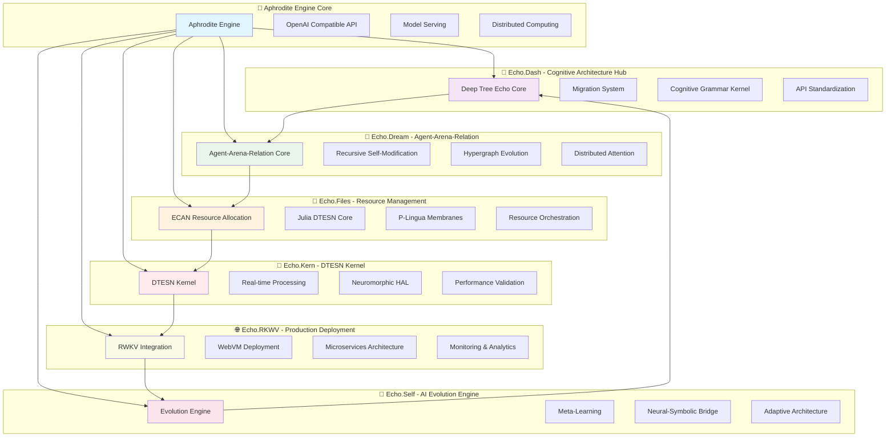

# Echo Systems Overview

The Aphrodite Engine integrates six specialized Echo systems that collectively provide advanced cognitive capabilities through Deep Tree Echo Membrane Computing.

## 🌟 Echo Systems Architecture



## 📊 Echo Systems Status Matrix

| System | Purpose | Status | Completion | Key Features |
|--------|---------|--------|------------|-------------|
| 🌳 **Echo.Dash** | Cognitive Architecture Hub | ✅ Active | 95% | Deep Tree Echo core, migration system, API standardization |
| 💭 **Echo.Dream** | Agent-Arena-Relation | ✅ Active | 90% | Distributed cognition, recursive self-modification |
| 📁 **Echo.Files** | Resource Management | ✅ Active | 85% | ECAN allocation, Julia DTESN cores, P-Lingua membranes |
| 🔧 **Echo.Kern** | DTESN Kernel | ✅ Active | 80% | Real-time processing, neuromorphic HAL |
| 🌐 **Echo.RKWV** | Production Deployment | ✅ Active | 95% | WebVM integration, microservices (2500+ req/min) |
| 🔄 **Echo.Self** | AI Evolution Engine | ✅ Active | 75% | Adaptive architecture, meta-learning |

## 🎯 4E Embodied AI Framework Integration

The Echo systems collectively implement the 4E Embodied AI Framework:

### Embodied
- **Sensory-Motor Integration**: Virtual sensory analogues with motor control
- **Proprioceptive Feedback**: Self-awareness and state monitoring
- **Physical Analogues**: Virtual physical interaction models

### Embedded
- **Environmental Context**: Situational awareness and adaptation
- **Resource Constraints**: Efficient resource utilization
- **Real-time Processing**: Low-latency response capabilities

### Extended
- **Cognitive Tools**: Advanced reasoning and planning capabilities
- **External Memory**: Distributed memory systems across Echo.Files
- **Collaborative Intelligence**: Multi-agent coordination via Echo.Dream

### Enactive
- **Active Perception**: Dynamic environment interaction
- **Experience-based Learning**: Continuous learning and adaptation
- **Emergent Behavior**: Complex behaviors from simple interactions

## 🔄 System Interactions

### Primary Data Flows
1. **Input Processing**: Echo.Dash → Echo.Kern → Echo.Files
2. **Cognitive Processing**: Echo.Dream ↔ Echo.Self ↔ Echo.Kern
3. **Output Generation**: Echo.Files → Echo.RKWV → Client

### Resource Management
- **Memory Allocation**: Echo.Files coordinates across all systems
- **Processing Distribution**: Echo.Dream manages multi-agent workloads
- **Performance Monitoring**: Echo.RKWV provides system-wide metrics

### Evolution and Adaptation
- **Architecture Updates**: Echo.Self evolves system configurations
- **Learning Integration**: All systems contribute to collective learning
- **Performance Optimization**: Continuous improvement across the ecosystem

## 🚀 Getting Started with Echo Systems

### Basic Configuration
```bash
# Enable all Echo systems
export ECHO_SYSTEMS_ENABLED=true
export DEEP_TREE_ECHO_MODE=full

# Start with basic Echo.Dash integration
aphrodite serve --echo-dash-enabled \
  --cognitive-architecture \
  --api-standardization
```

### Advanced Integration
```bash
# Full Echo systems deployment
aphrodite serve \
  --echo-all-systems \
  --aar-max-agents 1000 \
  --dtesn-real-time \
  --evolution-engine \
  --microservices-mode
```

## 📚 Further Reading

- [Echo.Dash Documentation](echo-dash.md)
- [Echo.Dream Documentation](echo-dream.md)
- [Echo.Files Documentation](echo-files.md)
- [Echo.Kern Documentation](echo-kern.md)
- [Echo.RKWV Documentation](echo-rkwv.md)
- [Echo.Self Documentation](echo-self.md)
- [Architecture Overview](../architecture/overview.md)
- [Technical Specifications](../technical/specifications.md)
