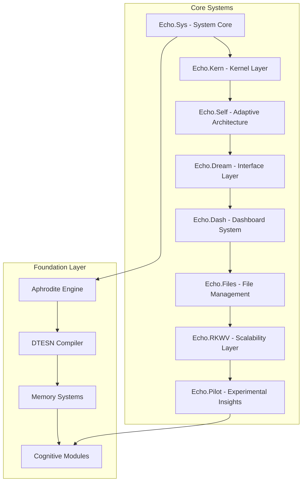

# Deep Tree Echo Systems - Complete Documentation Wiki

## Overview

Deep Tree Echo is a comprehensive cognitive architecture system that integrates multiple advanced AI technologies including Echo State Networks (ESNs), membrane computing, and modern LLM infrastructure through the Aphrodite Engine.

## System Architecture Overview

## Major System Components

### 1. [Echo System Core](echo-sys.md)
- System prompt management
- Character configuration (Pyper integration)
- VM daemon systems
- Spark system integration

### 2. [Echo Kernel](echo-kern.md)
- DTESN (Deep Tree Echo State Networks) implementation
- B-series differential computation
- P-system membrane computing
- Neuromorphic hardware abstraction

### 3. [Echo Self](echo-self.md)
- Adaptive architecture engine
- Meta-learning capabilities
- Evolution-based optimization
- Aphrodite integration bridge

### 4. [Echo Dream](echo-dream.md)
- Web interface and visualization
- Pattern exploration tools
- Memory management systems
- Connection mapping

### 5. [Echo Dashboard](echo-dash.md)
- System monitoring
- Activity regulation
- Cognitive evolution tracking
- Multi-modal integration

### 6. [Echo Files](echo-files.md)
- Document repository
- Knowledge management
- File system abstractions
- Content organization

### 7. [Echo RKWV](echo-rkwv.md)
- Scalable deployment infrastructure
- Kubernetes orchestration
- Monitoring and observability
- CI/CD pipelines

### 8. [Echo Pilot](echo-pilot.md)
- Experimental features
- GitHub Copilot integration
- Polyvisor insights
- VS Code extensions

## Technical Architecture

### Core Technologies
- **Echo State Networks**: Reservoir computing with hierarchical structures
- **Membrane Computing**: P-system based cognitive processing
- **Tensor Signature Computation**: Based on OEIS A000081 sequences
- **Deep Tree Structures**: Recursive cognitive architectures
- **Aphrodite Engine Integration**: High-performance LLM inference

### Mathematical Foundations
- Rooted tree enumeration (OEIS A000081)
- B-series differential equations
- Prime factor resonance calculations
- Gestalt state management
- Reservoir computing dynamics

## Integration Points

### Aphrodite Engine Integration
The system integrates deeply with the Aphrodite Engine for:
- High-performance inference
- Model serving capabilities
- Quantization support
- Multi-modal processing

### NanoCog Integration
- Cognitive evaluation loops
- Echo fidelity metrics
- Introspection capabilities
- Automated optimization

## Development Status

### Completed Systems
- ✅ Basic Echo State Network implementation
- ✅ DTESN kernel foundation
- ✅ Web interface (Echo Dream)
- ✅ Dashboard system
- ✅ File management
- ✅ Aphrodite integration bridge

### In Progress
- 🔄 Advanced cognitive modules
- 🔄 Membrane computing engine
- 🔄 Neuromorphic hardware support
- 🔄 Scalability improvements

### Planned Features
- ⏳ Distributed cognitive processing
- ⏳ Advanced visualization tools
- ⏳ Real-time adaptation
- ⏳ Production deployment

## Quick Start

1. **Setup**: Initialize the development environment
2. **Core**: Start with Echo.Sys for system fundamentals
3. **Interface**: Explore Echo.Dream for visual interaction
4. **Development**: Use Echo.Self for adaptive capabilities
5. **Monitoring**: Deploy Echo.Dash for system oversight

## Navigation

- [System Architecture](architecture/overview.md)
- [Technical Specifications](technical/specifications.md)
- [Development Guide](development/guide.md)
- [API Documentation](api/reference.md)
- [Deployment Guide](deployment/guide.md)
- [Roadmap](roadmap.md)

---

*This wiki provides comprehensive documentation for the Deep Tree Echo cognitive architecture system. For specific implementation details, refer to the individual component documentation.*
