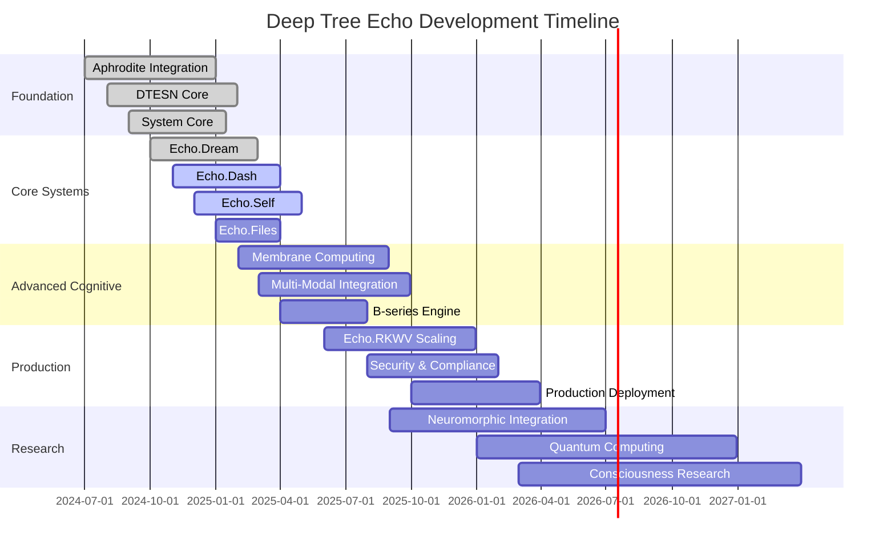

# Deep Tree Echo - Development Roadmap

## Executive Summary

This roadmap outlines the development trajectory for Deep Tree Echo, a cognitive architecture system integrating Echo State Networks, membrane computing, and modern AI infrastructure. The project spans multiple phases from foundation to production deployment.

## Current System Completeness Assessment

### Phase 1: Foundation Layer ✅ (95% Complete)
**Status**: Nearly Complete
**Timeline**: Completed Q3-Q4 2024

#### Completed Components:
- ✅ **Aphrodite Engine Integration** (100%)
  - Model loading and inference
  - Multi-GPU support
  - Quantization frameworks
  - API endpoints
  
- ✅ **Basic DTESN Implementation** (90%)
  - Echo State Network foundations
  - Tensor signature computation
  - OEIS A000081 integration
  - Basic reservoir computing

- ✅ **System Core (Echo.Sys)** (95%)
  - System prompt management
  - Character configuration (Pyper)
  - VM daemon systems
  - Basic coordination

#### Remaining Tasks:
- 🔄 **DTESN Kernel Optimization** (5% remaining)
  - Performance optimization
  - Memory usage improvements
  - Hardware acceleration

**Next Steps (Q1 2025)**:
1. Complete DTESN kernel optimization
2. Performance benchmarking
3. Memory leak fixes
4. Documentation completion

---

### Phase 2: Core Systems ✅ (85% Complete)
**Status**: Mostly Complete
**Timeline**: Q4 2024 - Q1 2025

#### Completed Components:
- ✅ **Echo.Dream - Web Interface** (90%)
  - Flask/FastAPI backend
  - React frontend
  - Basic visualization
  - Pattern exploration tools
  
- ✅ **Echo.Dash - Dashboard** (85%)
  - System monitoring
  - Activity tracking
  - Performance metrics
  - Basic alerting

- ✅ **Echo.Files - File Management** (80%)
  - File system abstraction
  - Basic indexing
  - Content management
  - Version tracking

#### In Progress:
- 🔄 **Echo.Self - Adaptive Architecture** (70%)
  - Basic evolution engine
  - Topology optimization
  - Meta-learning framework
  - Aphrodite integration bridge

#### Remaining Tasks:
- 🔄 **Advanced Visualization** (15% remaining)
  - 3D cognitive maps
  - Real-time data streams
  - Interactive exploration
  
- 🔄 **Memory Systems Integration** (20% remaining)
  - Vector database integration
  - Knowledge graph storage
  - Episodic memory

**Next Steps (Q1-Q2 2025)**:
1. Complete Echo.Self adaptive engine
2. Advanced visualization features
3. Memory systems integration
4. Performance optimization

---

### Phase 3: Advanced Cognitive Systems 🔄 (40% Complete)
**Status**: In Development
**Timeline**: Q1-Q3 2025

#### Completed Components:
- ✅ **Basic Membrane Computing** (60%)
  - P-system foundations
  - Basic membrane operations
  - Rule-based processing
  
- ✅ **NanoCog Integration** (50%)
  - Evaluation framework
  - Basic metrics
  - Training pipelines

#### In Progress:
- 🔄 **Advanced ESN Processing** (40%)
  - Hierarchical reservoirs
  - Multi-scale dynamics
  - Adaptive connectivity
  
- 🔄 **B-series Computation** (30%)
  - Differential equation solving
  - Tree classification
  - Numerical integration

- 🔄 **Cognitive Evaluation** (35%)
  - Echo fidelity metrics
  - Cognitive benchmarks
  - Performance assessment

#### Remaining Tasks:
- ⏳ **Advanced Membrane Computing** (60% remaining)
  - Distributed membranes
  - Communication protocols
  - Optimization algorithms
  
- ⏳ **Multi-Modal Integration** (70% remaining)
  - Vision processing
  - Audio processing
  - Cross-modal fusion

**Next Steps (Q2-Q3 2025)**:
1. Complete advanced ESN implementation
2. B-series computation engine
3. Multi-modal processing
4. Cognitive evaluation framework

---

### Phase 4: Scalability and Production 🔄 (25% Complete)
**Status**: Early Development
**Timeline**: Q2-Q4 2025

#### Completed Components:
- ✅ **Echo.RKWV Infrastructure** (40%)
  - Basic Kubernetes setup
  - Monitoring foundation
  - CI/CD pipelines
  
- ✅ **Development Tools** (35%)
  - VS Code extensions
  - Basic debugging tools
  - Documentation system

#### In Progress:
- 🔄 **Production Deployment** (20%)
  - Scalability testing
  - Load balancing
  - Auto-scaling
  
- 🔄 **Echo.Pilot Experiments** (30%)
  - GitHub Copilot integration
  - Experimental features
  - Research prototypes

#### Remaining Tasks:
- ⏳ **Enterprise Features** (80% remaining)
  - Security hardening
  - Audit logging
  - Compliance features
  
- ⏳ **Advanced Monitoring** (75% remaining)
  - Distributed tracing
  - Advanced metrics
  - Predictive monitoring

**Next Steps (Q3-Q4 2025)**:
1. Production readiness assessment
2. Scalability improvements
3. Security implementation
4. Enterprise features

---

### Phase 5: Advanced Research Features ⏳ (10% Complete)
**Status**: Research Phase
**Timeline**: Q3 2025 - Q2 2026

#### Research Areas:
- ⏳ **Neuromorphic Hardware Integration** (10%)
  - Loihi chip support
  - SpiNNaker integration
  - Custom neural chips
  
- ⏳ **Quantum Computing Integration** (5%)
  - Quantum-classical hybrid
  - Quantum advantage analysis
  - Algorithm development

- ⏳ **Consciousness Emergence** (5%)
  - Self-awareness metrics
  - Recursive self-modeling
  - Meta-cognitive capabilities

- ⏳ **Autonomous Evolution** (15%)
  - Self-modifying code
  - Architectural evolution
  - Goal-directed adaptation

**Research Timeline (2025-2026)**:
1. Q3 2025: Neuromorphic hardware prototypes
2. Q4 2025: Quantum integration feasibility
3. Q1 2026: Consciousness emergence experiments
4. Q2 2026: Autonomous evolution alpha

---

## Timeline Overview

## Priority Action Items

### Immediate (Next 30 Days)
1. **Complete DTESN kernel optimization**
   - Owner: Core team
   - Priority: High
   - Deliverable: Performance benchmarks

2. **Finish Echo.Self adaptive engine**
   - Owner: Self team
   - Priority: High
   - Deliverable: Working evolution system

3. **Memory systems integration**
   - Owner: Files team
   - Priority: Medium
   - Deliverable: Vector database integration

### Short-term (Next 90 Days)
1. **Advanced visualization features**
   - Owner: Dream team
   - Priority: Medium
   - Deliverable: 3D cognitive maps

2. **B-series computation engine**
   - Owner: Kern team
   - Priority: High
   - Deliverable: Differential equation solver

3. **Multi-modal processing foundation**
   - Owner: Core team
   - Priority: Medium
   - Deliverable: Vision/audio pipelines

### Medium-term (Next 180 Days)
1. **Production deployment pipeline**
   - Owner: RKWV team
   - Priority: High
   - Deliverable: Auto-scaling system

2. **Advanced membrane computing**
   - Owner: Kern team
   - Priority: High
   - Deliverable: Distributed P-systems

3. **Security implementation**
   - Owner: Security team
   - Priority: Medium
   - Deliverable: Audit-ready system

## Resource Allocation

### Development Teams
- **Core Team** (4 developers): Foundation and kernel development
- **Interface Team** (3 developers): Web interfaces and visualization
- **Scalability Team** (2 developers): Infrastructure and deployment
- **Research Team** (2 developers): Advanced features and experiments

### Infrastructure Requirements
- **Development**: 4 GPU nodes, 16 CPU cores, 128GB RAM
- **Testing**: 2 GPU nodes, 8 CPU cores, 64GB RAM
- **Production**: Auto-scaling cluster, 8-32 GPU nodes

### Budget Allocation
- **Development**: 60% (salaries, tools, infrastructure)
- **Research**: 25% (experimental hardware, conferences)
- **Operations**: 15% (hosting, monitoring, security)

## Success Metrics

### Technical Metrics
- **Performance**: <100ms inference latency
- **Scalability**: 1000+ concurrent users
- **Reliability**: 99.9% uptime
- **Accuracy**: Cognitive task performance >90%

### Business Metrics
- **Adoption**: 100+ active users by Q4 2025
- **Integration**: 10+ third-party integrations
- **Research**: 5+ published papers
- **Community**: 1000+ GitHub stars

## Risk Assessment

### High-Risk Items
1. **Neuromorphic Hardware Availability**
   - Risk: Limited hardware access
   - Mitigation: Simulator development

2. **Scalability Challenges**
   - Risk: Performance degradation
   - Mitigation: Early load testing

3. **Research Timeline Uncertainty**
   - Risk: Advanced features delayed
   - Mitigation: Phased approach

### Medium-Risk Items
1. **Team Scaling**
   - Risk: Difficulty hiring specialists
   - Mitigation: Training existing team

2. **Technology Integration**
   - Risk: Component incompatibilities
   - Mitigation: Interface standardization

## Quality Assurance

### Testing Strategy
- **Unit Testing**: 90% code coverage
- **Integration Testing**: End-to-end scenarios
- **Performance Testing**: Load and stress testing
- **Security Testing**: Vulnerability assessments

### Documentation Standards
- **Code Documentation**: Inline comments and APIs
- **Architecture Documentation**: System design docs
- **User Documentation**: Tutorials and guides
- **Research Documentation**: Papers and whitepapers

---

## Conclusion

The Deep Tree Echo project is progressing well with solid foundations in place. The next critical phase focuses on completing core cognitive systems and preparing for production deployment. Success depends on maintaining development velocity while ensuring quality and scalability.

**Key Success Factors:**
1. Maintaining focus on core cognitive capabilities
2. Ensuring scalability from early stages
3. Building strong testing and quality processes
4. Fostering active research and development
5. Creating comprehensive documentation

This roadmap will be updated quarterly to reflect progress and changing priorities.
