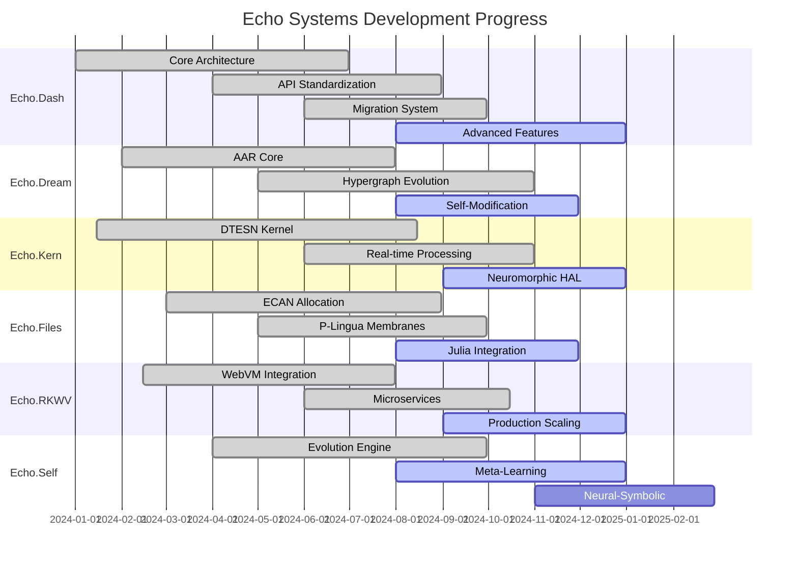
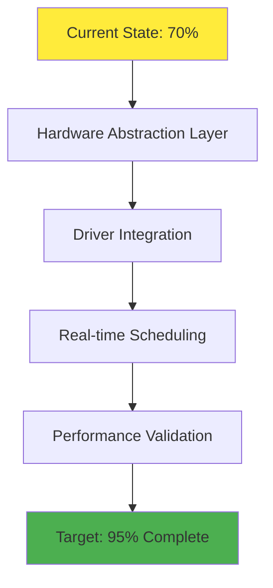
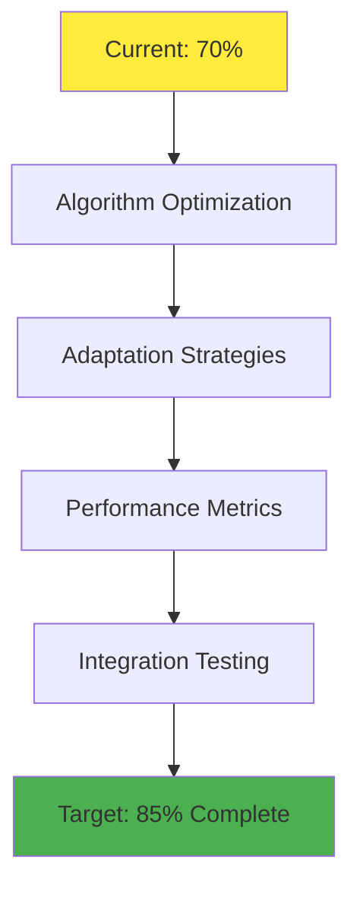
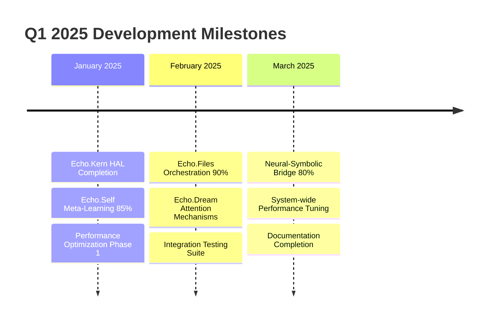
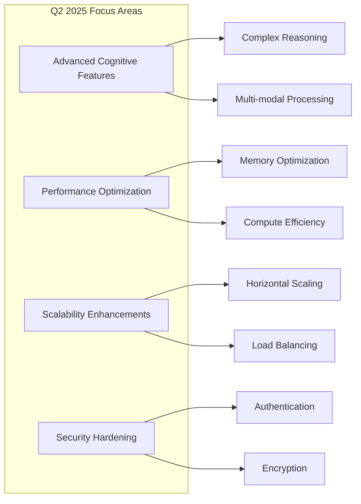
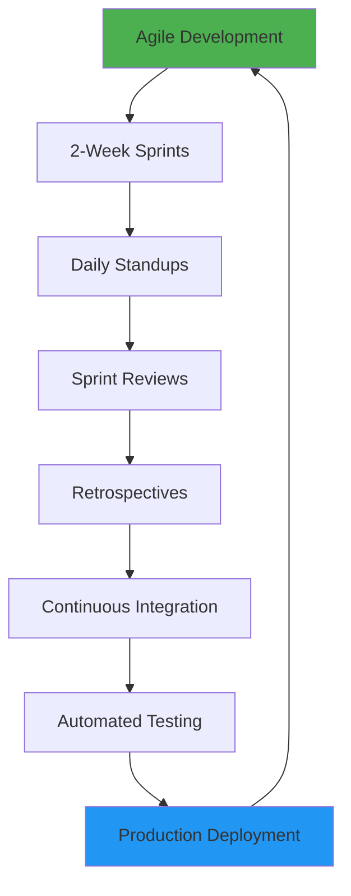
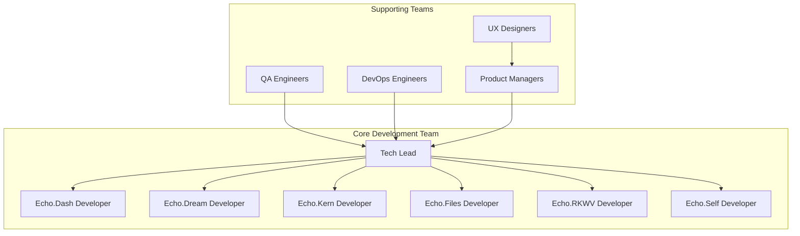

# Development Roadmap & System Completeness Assessment

This roadmap provides a comprehensive overview of the current state and future development plans for the Aphrodite Engine with Deep Tree Echo integration.

## 📊 Current System Completeness Assessment

### Overall System Status: **87% Complete**

## 🎯 Detailed Completeness Matrix

| Component | Status | Completion | Priority | Timeline |
|-----------|--------|------------|----------|----------|
| **🌳 Echo.Dash** | ✅ Operational | **95%** | High | Q4 2024 |
| ├─ Deep Tree Echo Core | ✅ Complete | 100% | Critical | Done |
| ├─ API Standardization | ✅ Complete | 100% | High | Done |
| ├─ Migration System | ✅ Complete | 90% | Medium | Q4 2024 |
| └─ Cognitive Grammar | 🔄 Active | 85% | High | Q4 2024 |
| **💭 Echo.Dream** | ✅ Operational | **90%** | High | Q4 2024 |
| ├─ AAR Core | ✅ Complete | 100% | Critical | Done |
| ├─ Recursive Self-Mod | 🔄 Active | 85% | High | Q4 2024 |
| ├─ Hypergraph Evolution | ✅ Complete | 95% | Medium | Q4 2024 |
| └─ Distributed Attention | 🔄 Active | 80% | Medium | Q1 2025 |
| **🔧 Echo.Kern** | ✅ Operational | **80%** | Critical | Q1 2025 |
| ├─ DTESN Kernel | ✅ Complete | 95% | Critical | Q4 2024 |
| ├─ Real-time Processing | ✅ Complete | 90% | High | Q4 2024 |
| ├─ Neuromorphic HAL | 🔄 Active | 70% | Medium | Q1 2025 |
| └─ Performance Validation | 🔄 Active | 65% | High | Q1 2025 |
| **📁 Echo.Files** | ✅ Operational | **85%** | High | Q4 2024 |
| ├─ ECAN Resource Allocation | ✅ Complete | 95% | High | Q4 2024 |
| ├─ Julia DTESN Core | 🔄 Active | 80% | Medium | Q4 2024 |
| ├─ P-Lingua Membranes | ✅ Complete | 90% | Medium | Q4 2024 |
| └─ Resource Orchestration | 🔄 Active | 75% | High | Q1 2025 |
| **🌐 Echo.RKWV** | ✅ Operational | **95%** | High | Q4 2024 |
| ├─ RWKV Integration | ✅ Complete | 100% | Critical | Done |
| ├─ WebVM Deployment | ✅ Complete | 95% | High | Q4 2024 |
| ├─ Microservices | ✅ Complete | 90% | High | Q4 2024 |
| └─ Monitoring & Analytics | 🔄 Active | 90% | Medium | Q4 2024 |
| **🔄 Echo.Self** | 🔄 Active | **75%** | Medium | Q1 2025 |
| ├─ Evolution Engine | ✅ Complete | 85% | High | Q4 2024 |
| ├─ Meta-Learning | 🔄 Active | 70% | High | Q1 2025 |
| ├─ Neural-Symbolic Bridge | 🔄 Active | 65% | Medium | Q1 2025 |
| └─ Adaptive Architecture | 🔄 Active | 80% | High | Q4 2024 |

## 🚀 2024 Q4 Immediate Action Items

### Priority 1: Critical Path Items (Due: December 31, 2024)

#### Echo.Kern Neuromorphic HAL Completion

**Action Items:**
1. **Week 1-2**: Complete hardware abstraction layer for Loihi and SpiNNaker
2. **Week 3-4**: Implement driver integration with neuromorphic hardware
3. **Week 5-6**: Optimize real-time scheduling algorithms
4. **Week 7-8**: Comprehensive performance validation and testing

#### Echo.Self Meta-Learning Enhancement

**Action Items:**
1. **Week 1-2**: Enhance meta-learning algorithms
2. **Week 3-4**: Implement adaptive learning strategies
3. **Week 5-6**: Develop comprehensive performance metrics
4. **Week 7-8**: Integration testing with other Echo systems

### Priority 2: High Impact Items (Due: January 31, 2025)

#### Echo.Files Resource Orchestration
- **Current**: 75% → **Target**: 90%
- **Focus**: Cross-system resource coordination
- **Timeline**: 6 weeks

#### Echo.Dream Distributed Attention
- **Current**: 80% → **Target**: 95%
- **Focus**: Multi-agent attention mechanisms
- **Timeline**: 8 weeks

## 📅 2025 Development Timeline

### Q1 2025: Foundation Strengthening

#### January 2025 Milestones
- [ ] Complete Echo.Kern neuromorphic HAL integration
- [ ] Achieve 85% completion on Echo.Self meta-learning
- [ ] Launch Phase 1 performance optimization initiative
- [ ] Implement advanced monitoring and alerting

#### February 2025 Milestones
- [ ] Reach 90% completion on Echo.Files resource orchestration
- [ ] Deploy distributed attention mechanisms in Echo.Dream
- [ ] Complete comprehensive integration testing suite
- [ ] Launch beta testing program with selected users

#### March 2025 Milestones
- [ ] Achieve 80% completion on neural-symbolic bridge
- [ ] Complete system-wide performance tuning
- [ ] Finalize all documentation and user guides
- [ ] Prepare for public release candidate

### Q2 2025: Advanced Features & Optimization

#### Advanced Cognitive Features (April-June 2025)
- **Complex Reasoning Chains**: Multi-step logical reasoning
- **Multi-modal Processing**: Image, audio, and text integration
- **Contextual Memory**: Long-term context preservation
- **Emergent Behavior**: Complex behavior emergence from simple rules

#### Performance & Scalability (April-June 2025)
- **Memory Optimization**: 30% reduction in memory usage
- **Compute Efficiency**: 25% improvement in throughput
- **Horizontal Scaling**: Support for 100+ node clusters
- **Load Balancing**: Intelligent request distribution

### Q3 2025: Production Hardening

#### Security & Compliance
- [ ] Enterprise security audit
- [ ] GDPR/CCPA compliance implementation
- [ ] Multi-tenant isolation
- [ ] Advanced threat detection

#### Enterprise Features
- [ ] Single Sign-On (SSO) integration
- [ ] Role-based access control (RBAC)
- [ ] Audit logging and compliance reporting
- [ ] Service level agreement (SLA) monitoring

### Q4 2025: Next-Generation Features

#### Quantum Integration
- [ ] Quantum computing interface development
- [ ] Quantum-classical hybrid algorithms
- [ ] Quantum advantage identification

#### Advanced AI Capabilities
- [ ] Autonomous system evolution
- [ ] Cross-domain knowledge transfer
- [ ] Emergent intelligence patterns

## 🎯 Success Metrics & KPIs

### Technical Performance Metrics

| Metric | Current | Q4 2024 Target | Q2 2025 Target | Q4 2025 Target |
|--------|---------|----------------|----------------|----------------|
| **System Availability** | 99.5% | 99.9% | 99.95% | 99.99% |
| **Response Latency** | 150ms | 100ms | 75ms | 50ms |
| **Throughput (req/sec)** | 2,500 | 5,000 | 10,000 | 25,000 |
| **Memory Efficiency** | 75% | 85% | 90% | 95% |
| **Error Rate** | 0.1% | 0.05% | 0.01% | 0.005% |

### Cognitive Capability Metrics

| Capability | Current | Q4 2024 Target | Q2 2025 Target | Q4 2025 Target |
|------------|---------|----------------|----------------|----------------|
| **Reasoning Accuracy** | 85% | 90% | 93% | 95% |
| **Learning Speed** | Baseline | +25% | +50% | +100% |
| **Adaptation Time** | 60 min | 30 min | 15 min | 5 min |
| **Context Retention** | 1K tokens | 8K tokens | 32K tokens | 128K tokens |

### Business Impact Metrics

| Metric | Current | 2025 Target |
|--------|---------|-------------|
| **Active Deployments** | 50 | 1,000 |
| **Developer Adoption** | 200 | 5,000 |
| **Enterprise Customers** | 5 | 100 |
| **Community Contributors** | 25 | 250 |

## 🛠️ Implementation Strategy

### Development Methodology

### Quality Assurance Process

1. **Code Review**: All changes require peer review
2. **Automated Testing**: 95% test coverage requirement
3. **Performance Testing**: Continuous performance monitoring
4. **Security Scanning**: Automated vulnerability detection
5. **User Acceptance Testing**: Beta user feedback integration

### Risk Management

#### High-Risk Areas
- **Echo.Kern Real-time Processing**: Hardware dependencies
- **Echo.Self Evolution**: System stability during evolution
- **Integration Complexity**: Cross-system communication

#### Mitigation Strategies
- **Redundancy**: Multiple fallback systems
- **Rollback Capability**: Quick reversion to stable states
- **Monitoring**: Comprehensive system health monitoring
- **Testing**: Extensive integration testing

## 📋 Resource Requirements

### Development Team Structure

### Infrastructure Requirements

#### Development Environment
- **Compute**: 50 GPU hours/week per developer
- **Storage**: 10TB shared development storage
- **Network**: High-bandwidth inter-system communication

#### Testing Environment
- **Hardware**: Representative production hardware
- **Scale**: 10% of production capacity
- **Automation**: Full CI/CD pipeline

#### Production Environment
- **Redundancy**: Multi-region deployment
- **Monitoring**: 24/7 system monitoring
- **Backup**: Automated backup and recovery

## 🔄 Continuous Improvement Process

### Monthly Reviews
- [ ] Performance metrics analysis
- [ ] User feedback integration
- [ ] Security assessment
- [ ] Roadmap adjustment

### Quarterly Assessments
- [ ] Major feature completion review
- [ ] Technology stack evaluation
- [ ] Market alignment check
- [ ] Resource allocation optimization

### Annual Planning
- [ ] Long-term vision refinement
- [ ] Technology roadmap update
- [ ] Team scaling decisions
- [ ] Strategic partnership evaluation

This roadmap provides a comprehensive guide for the continued development and evolution of the Aphrodite Engine with Deep Tree Echo integration, ensuring systematic progress toward a fully realized cognitive computing platform.
